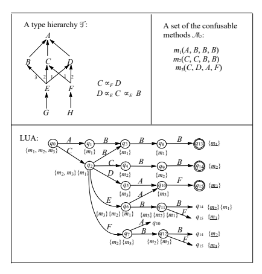
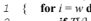
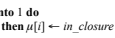
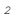
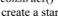
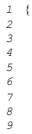
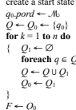
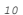

# Efficient Dynamic Look-Up Strategy For Multi-Methods

Weimin Chen*, Volker Turau**, and Wolfgang Klas*
*GMD-IPSI
Integrated Publication and Information Systems Institute Dolivostr. 15 64293 Darmstadt, Germany Email: {chen, klas}@darmstadt.gmd.de
**Fachhochschule Giessen-Friedberg Fachbereich MND
Wilhelm-Leuschner-Str. 13 61169 Friedberg, Germany Email: turau@prfhfb.fh-friedberg.de Abstract. In object-oriented programming languages, multiple dispatching provides increased expressive power over single dispatching by guiding method lookup using the values of all arguments instead of the receiver only. There have been several programming languages supporting this mechanism and they demonstrate its usefulness. However, efficient implementation of multi-methods is critical with regard to its success as a standard. In this paper, we present a new mechanism for implementing multi-methods dynamic lookup based on automaton techniques. Analysis and experimental results show that our strategy is time and space efficient.

The presented result can provide the basis for designing new object-oriented paradigms based on multi-methods.

## 1 Introduction

Today most programming languages are based on the notion of types. A data type consists of a representation and a set of operations which can be applied to instances of the types. In many object-oriented languages, types are organized in a hierarchy and a subtype relation is defined over them. One important feature of this subtype relation is the *subtype polymorphism* [7]: if A is a subtype of B, then every instance of A is also an instance of B. Operations on the instances of types are defined by generic functions, where a generic function corresponds to a set of *methods* and the methods define the type-specific behavior of the generic function. In the presence of subtype polymorphism, method selection must occur at run time.

In many object-oriented languages, a message (function invocation) is sent to a distinguished receiver object, and the run time "type" of the receiver determines the method that is actually invoked by the message. The arguments of the message are passed on to the invoked method but do not participate in the method dispatching. For example, in C++ we can define a virtual function of the form float area(shape)1 which is dynamically dispatched based on the actual type of shape supplied with the function invocation. However, one cannot write a virtual function of
–––––––––––––––––––––––––––––––––––––––––––––– 1. the first argument can be understood as the method receiver.

the form displayOn(shape,device) which is dynamically dispatched based on actual types of both shape and device.

To surmount these limitations, some object-oriented languages include a more powerful form of function invocation in which all arguments of a method can participate in the method dispatching (method lookup), i.e. a method is dynamically dispatched based on the types of all arguments. These methods are called *multi-methods*.

The dispatching for multi-methods is called *multi-dispatching*. Perhaps the mostknown languages that support multi-methods are CLOS [6] and its ancestor CommonLisp [5].

One fundamental issue for multi-methods is the efficient mechanism for method lookup. Efficient implementation of multi-methods is critical with regard to its success as a standard. There have been several time-efficient lookup mechanisms proposed [11, 13, 16]. However, by far the largest problem is that all these structures for dynamic lookup may lead to combinatorial explosion, which leads to a space problem. Based on the result of Agrawal, *et al*. [2] on static type checking of multi-methods, in this paper we present a new mechanism for multi-method lookup using lookup automatons. If n is the arity of the function invocation, then the time complexity of the method lookup is O(n). The main contribution of our approach compared to the other lookup mechanisms is that it is more space-efficient while providing the same time-efficiency as [11, 13, 16]. The results presented are intended to provide a general technique to optimize the performance of dispatching for multi-methods.

The organization of this paper is as follows. We state the basic concepts concerning the type hierarchy and multi-methods in section 2. Section 3 describes the overall approach in order to have an intuitive idea of our approach. The formal statement of the problem is presented in section 4. Next, sections 5 and 6 discuss algorithms to construct and simulate the lookup automaton respectively. Experimental results are discussed in section 7. We discuss the related work in section 8. Finally section 9 summarizes the results of our work.

## 2 Basic Concepts 2.1 Type Hierarchy And Type Ordering

In the discussion that follows, we represent the subtype relation by  in a type hierarchy -. Also we denote A  B if A  B and A  B, in this case we say that A is subtype of B, or B is *supertype* of A. Particularly, we use A

B to denote that B is a direct supertype of A. Since relation  defines a partial order, such a system of types forms a directed acyclic graph (DAG). There is a path from A to B if and only if A  B. In the rest of this paper, a type A in - is denoted by A∈-, and S which is subset of types in - is denoted by S ⊆ -.

A *local type ordering for a type C* is a total order -C over C and its supertypes such that if C  A or C  B, then C-C A, C-C B, and either A-C *B or B*-C A. Furthermore, if CB, and if D-B E in the local type ordering for type B, then D-C E in the local type ordering for the type C, and this rule is recursively applied. This rule must be based on the restriction that there must not exist another type B≠ B such that CB and E-B D. If this restriction is satisfied, - is called *consistent*. In this paper, we always assume that - is consistent.

CLOS [6] is an example of a language that uses local type ordering to determine the type precedence. In this paper, we discuss the general lookup techniques for languages which use the local type ordering to determine the type precedence, while noticing possible simplified cases if  is a directed tree (single inheritance).

## 2.2 Method Applicability, Confusability, Specificity, And Consistency

The main concepts concerning multi-methods which we use in this paper are presented in [2]:
 - *method applicability* –– given a generic function invocation, m(T1,...,Tn), we say that a method mk(T
k 1
,...,T
k n) is *applicable* for that invocation if and only if Ti  T
k i for 1 - i - n;
 - *method confusability* –– if two methods are both applicable for a function invocation, we say that they are *confusable*. Formally, methods m1(T
1 1
,...,T
1 n) and m2(T
2 1
,...,T
2 n)
2 are *confusable* if ∀i, 1 - i - n, there exists a type Ti, such that Ti  T
1 i and Ti  T
2 i
; otherwise they are *non-confusable*. The equivalence classes of the transitive extension of the relation *confusable* are called *confusable sets*. If - is a *confusable set* of methods and mi and mj are in - then there are k ( 0) methods m1, m2, ..., mk in - such that mi is confusable with m1, m1 is confusable with m2, ..., and mk is confusable with mj. We say that a generic function invocation m(T1,...,Tn) is *covered by* a confusable set - if there exists a method m∈- such that m is applicable for m;
 - *method specificity* –– if one method has precedence over another for a given invocation, we say that it is *more specific* than the other. One mechanism is called *inheritance order precedence*: while suppose mi(T
i 1
,...,T
i n) and mj(T
j 1
,...,T
j n
) are two applicable methods for a generic function invocation m(T1,...,Tn), we consider their formal arguments in a prespecified order (such as left-to-right3), and find the first argument position in which the formal argument types of mi and mj differ, say k. If T
i kTk T
j k
, then mi is more specific than mj, and vice versa. The inheritance order precedence is sufficient to determine method specificity in a multi inheritance language with multi-methods [2]. CLOS is an example of a language that uses inheritance order precedence to determine method specificity.

 - *method consistency* –– two methods mi(T
i 1
,...,T
i n)  Ri (Ri denotes the type of the result) and mj(T
j 1
,...,T
j n
)  Rj of a generic function M are *mutually consistent* if whenever they are both applicable for arguments of types T1,...,Tn and mi is more specific than mj, then Ri  Rj. A generic function is *consistent* if all its methods are mutually consistent.

–––––––––––––––––––––––––––––––––––––––––––– 2. For the sake of easy description, the method names are subscripted. In real system, however, the names of the confusable methods are identical. 3. Any prespecified order can be transformed as left-to-right by exchanging the argument location during compile time. Hence, without loss of generality, we can assume that the prespecified order is left-to-right during dispatching.

## 2.3 An Important Result

An important result presented in [2] for static type checking of multi-methods is the following.

THEOREM 1. A generic function invocation m(T1,...,Tn) is covered by at most one confusable set -, which can be determined at compile time. 

Based upon this result, the task of dynamic dispatching is to find the most specific method (in the confusable set -) for the given generic function invocation.

## 3 Overview Of Our Dispatching Approach

In order to have an intuitive idea of our approach, in this section we view the overall approach of multi-dispatching by presenting examples. We introduce a *lookup automaton (LUA*) to simulate the dynamic dispatching in a given confusable set. An LUA is a deterministic finite automaton [3] and is defined as 5-tuple  = (Q, , -, q0, F),
where Q is a finite set of *states*;  is a finite set of *input symbols*; - is a *state transition* function, which is a mapping Q    Q; q0 ∈Q is the *initial state* of the finite state control; and F ⊆ Q is the set of *final states*.

Fig. 1 shows an example of a type hierarchy , a confusable set -, and the corresponding LUA. In the LUA, we indicate the method precedence order at each state by a list of sets of methods. Suppose that at state q the list is a1a2 ... al (where ai ⊆-),
and method m1 ∈ ai and m2 ∈ aj. If *i < j*, then method m1 at state q will have higher priority to be selected than m2; if i = j, then m1 and m2 at state q will have the same priority to be selected. For example, consider the list {m2, m3}{m1} at state q2: method m2 (or m3) has higher priority to be selected than the other method m1, while m2 and m3 have the same priority to be selected.

The basic idea to construct the LUA is the following: in order to reduce the size of the LUA, the number of states introduced should be as small as possible. Informally, if states have the same precedence order, they will be "merged" together. In order to easily catch the idea, we firstly state how to simulate this LUA. Afterwards, we describe the overall approach of how to construct it.

In the discussion of this paragraph, we use upper case letters to denote types and the corresponding lower case letters to denote their instances. For example, we write a to denote an instance of type A. Now we consider a generic function invocation m(e, h, *c, f*). Initially we are at start state q0. There are two types A and C following state q0.

We select transition -(q0, C) = q2 because, in the set {A, C}, C is the most specific supertype of the first argument type E. At state q2, five types B, C, D, E, and F follow.

We select transition -(q2, F) = q7 because, in the set {B, C, *D, E, F*}, F is *the most* specific supertype of the second argument type H. Similarly, the next state transitions are -(q7, A) = q10 and -(q10, A) = q15. At the final state q15, method m3 is the most specific method for the given invocation. Note that, during the LUA simulation, only the knowledge of relation - is needed. The number of state transitions is equal to the function arity 4.

The LUA in Fig. 1 is constructed as follows. At first, the initial state q0 is created, where three methods m1, m2, and m3 may be applicable with the same priority, i.e. at q0



Fig. 1. An example of type hierarchy, method confusable set, and corresponding LUA
the method precedence order is {m1, m2, m3}. At the next level, the set of the first argument types of the methods m1, m2, and m3 is {A, C}. Consider the state transitions
(q0, A) and (q0, C). At the state (q0, A), only method m1 may be applicable, so that we create a new state q1 = (q0, A) with precedence order {m1}; at state (q0, C), three methods m1, m2, and m3 may be applicable but m2 and m3 have higher priority to be selected than m1, i.e. the precedence order is {m2, m3}{m1}. At this level, so far there is still no state with precedence order {m2, m3}{m1}. Thus, a new state q2 = (q0, C) with precedence order {m2, m3}{m1} is created. Now consider the situation at the next level. At state q1, only m1 may be applicable, so that only state transition (q1, B) is considered (B is the second argument type of m1). We create a new state q3 = (q1, B) with precedence order {m1}. At state q2, the possible applicable methods are m1, m2, and m3, so the state transitions (q2, B), (q2, C), and (q2, D) must be considered.

Since the state (q2, B) is with precedence order {m1}, which is the same as the precedence order at state q3, we defined (q2, B) = q3. Similar to the situation of state transition (q0, B), the new states q4 = (q2, C) and q5 = (q2, D) are created. Now, at q2, we have introduced the transitions (q2, B), (q2, C), and (q2, D). In order to simulate all possible cases, however, it is still necessary to introduce transitions (q2, E) and (q2, F). We will explain this in the next paragraph. Going on with this procedure, at last we construct the whole LUA, where the final states are with double circles, and the most specific methods at final states are underscored.

We turn back to discuss why at state q2 it is necessary to introduce the additional transitions (q2, E) and (q2, F). Consider the case that these additional transitions are not introduced. Recall that m3 is the most specific method for the above invocation m(e, h, c, f). For this function invocation we consider the LUA simulation again. At first, for the first argument type E, we select transition (q0, C) = q2. Consider the second argument type H. As types E and F are not introduced at q2, in the set of the remaining types {B, C, D}, finding the most specific supertype of H needs knowledge of the relationH rather than the relation -. By the relationship CH D (since CF D
holds and  is consistent), we know that, in set {B, C, *D}, C* is the most specific supertype of H with respect toH . Thus, at state q2 the state transition (q2, C) = q4 is selected. Clearly the simulation is not correct –– since eventually the most specific method m3 is not in the path following q4. Therefore, a backtracking is required to re-select the state transition as (q2, D) instead of (q2, C). Hence, if the types E and F
are not introduced at state q2, there will be two consequences during the simulation:
the knowledge of relation H instead of relation - is needed, and the backtracking is required.

Given a confusable set and a type hierarchy, there is another possibility to construct the LUA. At first, one can simply enumerate all possible dispatching cases and then represent that by a finite automaton. Afterwards, standard techniques to minimize this automaton can be employed. This seems to be a natural way for constructing the LUA. However, there are some problems with this approach when used it for larger systems. The main weakness is that, before minimizing the automaton, a large memory overhead may take place because representing all possible dispatching cases may lead the automaton to be combinatorial explosive4. Consequently, the procedure to minimize the automaton can become very expensive. In an approach presented in this paper we overcome this weakness by addressing the construction and minimization of the LUA simultaneously: the procedure to reduce the size of the LUA is performed at the time of constructing the LUA. Consequently, with our approach the large memory overhead is prevented because unnecessary states of the LUA are never created.

## 4 Formal Statement Of The Problem

In this section, we present the terminology and notation which we will be employing throughout the paper. Moreover, we indicate the several associated results.

## 4.1 The Operator  And The Function M* (K)

In the following we always assume that - is a confusable set of methods with arity n.

Let  be the set { a1a2...ap  p >0, ai ⊆-, ai  aj = ∅, for i ≠ j}. The list a1a2...ap is
–––––––––––––––––––––––––––––––––––––––––––––– 4. In section 7, experimental results will show the degree of this combinatorial explosion.

represented by p i1 ai and the ai (i = 1, ..., n) are called factors of p i1 ai. Note that the order among the factors is important, e.g. a1a2a2a1. An operator :  ×  	 
is defined by A  B = 
q i1 p j1 ai  bj, for A = 
p i1 ai and B = 
q i1 bi ∈  . Clearly A  B
∈ . In this paper, we always assume that all factors of elements of  are not empty.

Therefore, if a factor in A  B is empty we omit it. For A, B ∈ , we say A = B if and only if they have the same factor list after omitting all empty factors. A function doi1 ai, for A = 
p main:  	 2 is defined by *domain(A*) = 
p i1 ai ∈ . Let m1, m2 ∈
domain(A) then we say that m1 ∈ai precedes m2 ∈aj with respect to A if i < j.

The function T(k):  	  is defined to map a method to its k-th argument type, i.e. T(k)(m(t1,t2,...,tn)) = tk, for m(t1,t2,...,tn) ∈. An inverse function T
1
(k)
:  	 2 can be defined by means of T
1
(k)
(t) = {m∈  T(k)
(m) = t }. Moreover, we define a function M*
(k):   2
 	  by means of M*
(k)(t, S) = 
l i1 T
1
(k)
(ti),
where (t1,...,tl) is a precedence list for t with respect to the set {t- ∈S  t  t-} such that ti tti-1, for 1  i < l.

PROPOSITION 2. For all A, B, and C ∈ the following holds:
 (a) (*associativity*) (A  B)  C = A  (B  C);
 (b) (*conditional commutativity*) A  B = B  A, if A or B consists of only one factor;
 (c) (*identity element*) A   =   A = A, if we regard  ∈;
 (d) *domain*(A  B) = *domain*(A)  *domain*(B);
 (e) for ∀ t ∈, M*
(k)(t,T(k)
()) ∈ represents a precedence order for the methods
(in ) whose the k-th argument types are the supertypes of t;
 (f) for ∀ t ∈  and ∀ S ⊆, A  M*
(k)
(t, S) = A  M*
(k)t, S  T(k)
(*domain(A*)).

PROOF. (a), (b), (c), (d), and (e) can be directly derived from the definitions of operator  and function M*
(k)(t, S).

(f) for ∀s ∈ *S - T*(k)
(*domain(A*)), we have *domain(A*)  T
1
(k)
(s) = ∅. By definition, M*
(k)(t, S) = 
l i1 T
1
(k)
(ti), where (t1,...,tl) is a precedence list for t with respect to the set
{t- ∈ S  tt-} such that titti-1, for 1  i < l. Suppose that { t1,...,tl} 
T(k)
(*domain(A*)) = {ti1
,...,tiq
} and A = 
p i1 ai. Thus, for ∀t- ∈ { t1,...,tl} - {ti1
,...,tiq
},
we have *domain(A)* T
1
(k)
(t
-
) = ∅. Therefore, A  M*
(k)
(t, S) = 
p i1 l j1 ai  T
1
(k)
(tj) =

$\prod\limits_{i=1}^{p}\prod\limits_{j=1}^{q}\left(a_{i}\cap T_{(k)}^{-1}(t_{j})\right)=A\ \ \Pi\ \ M_{(k)}^{\star}(t,S\cap T_{(k)}(domain(A)))$.  
(*domain(A*)). 
The operator  and the functions *domain* and T(k) are easily implemented. However, the implementation of M*
(k)(t, S) will rely on the algorithm for determining the precedence list (t1,...,tl) for t with respect to the set {t ∈S  t  t} such that ti-tti1for 1  i < l. Ducournau, *et al*. [10] discussed this supertype linearization problem in general. In the context of CLOS, however, Bobrow, *et al*. [6] proposed a concrete algorithm to determine the precedence list. For every c ∈, define Rc = {(c, c1), (c1, c2), ..., (ck–1, ck)}, where c1, ..., ck are the direct supertypes of c, and ci-c ci1for 1  i < k. Let Tc be the set of type c and its supertypes. Let R
=cTt Rc. To compute the precedence list for t, topological sorting proceeds by finding a type c in Tt such that no other type precedes that element according to the elements in R. The type c is placed first in the result. Remove c from Tt, and remove all pairs of the form (c, c), c∈Tt, from R. Repeat the process, adding types with no predecessors to the end of the result. Stop when no element can be found that has no predecessor.

Using this technique, we compute the precedence list (t1,...,tl) for t with respect to Tt.

In our application, we can extract all ti ∈S from the list (t1,...,tl). For the special case that  is a directed tree, the algorithm will be much simpler. We will not describe these algorithms any further.

## 4.2 The Functions Glb, Closure, And Lub

Given two types s, t ∈, we define *GLB(s, t*) = {u∈  us (and t), and ¬∃u∈ ,
such that uus (and t) }, the set of *greatest lower bounds* for s and t 5. For a subset of types S ⊆ , we say S closed if *GLB(s*, t) ⊆ S for ∀ s, t ∈ S. The *closure* of a subset S, *closure*(S), is defined as the intersection of all closed subsets T such that S ⊆ T ⊆ .

Clearly *closure(S*) is closed. On the other hand, for an t ∈  and S ⊆ , we define LUB(t, S) = {s ∈ S  t  s, ¬∃ s∈ S such that t ss } ⊆S, the set of *least upper* bounds of t in S
6. For example, in the type hierarchy  shown in Fig. 1, *GLB(C*, D) =
{E, F}, *closure({C, D*}) = {C, D, *E, F*}, and LUB*(G, {A, C*, D}) = {C, D}.

The following propositions are the direct results of the definitions of GLB and LUB.

PROPOSITION 3. Let *s, t*1, t2 ∈, such that st1 and st2. Then ∃ s∈ *GLB(t*1, t2), such that ss. -
PROPOSITION 4. Let t ∈ , S ⊆ , and s ∈ S. If t s, then ∃ s∈ LUB*(t, S*), such that tss. -
THEOREM 5. Let S ⊆ . Then S is closed if and only if for ∀ t ∈, LUB*(t, S*) contains at most one element.

8 PROOF. if: Let s1, s2 ∈ S. It suffices to prove that *GLB(s*1, s2) ⊆ S. Let s ∈ GLB(s1, s2).

By proposition 4, ∃ s
-

1
, s
-

2 ∈ LUB*(s, S*) such that ss
-

i si for i = 1, 2. By assump-
–––––––––––––––––––––––––––––––––––––––––––––– 5. In order to keep things simple, we borrow the notation GLB which is originally defined in lattice structures, where GLB is a unique element. However, in a DAG, we define GLB to be a set.

6. In order to distinguish our notion from the well-known standard notion LUB defined in lattice structure, we use the notation LUB.
tion, LUB-(s, S) contains at most one element. Hence, s 1 = s 2
. Now s ∈GLB(s1, s2)
implies that s = s 1
 ∈ LUB-(s, S) ⊆ S.

only if: Let S be closed and let t ∈-. Furthermore let s1, s2 ∈ LUB-(t, S). Clearly if t ∈ S then s1 = s2 (= t). Thus, we assume that t ∉ S. This induces *t ∉GLB(s*1, s2), as S is closed. Furthermore, we have t  s1 and ts2. Therefore, by proposition 3, ∃ s ∈ *GLB(s*1, s2) such that t-s. Hence, by the definition of LUB-, s = s1 and s = s2 hold.

This implies that  LUB-(t, S)   1. 

The following is the algorithm for *closure* and the algorithm for the function LUB-. Initially, a topological sorting is performed on the types of - with respect to the relation -. Let w be the number of types of - and let T[1], T[2], ..., and T[w] be the types of - such that T[i]-T[j] holds only if i < j.

In the function *closure*, a variable - of type array[1 .. w] of {not_in_closure, *in_closure*} is needed. Initially, -[i] = *not_in_closure*, for 1 iw.

function *closure(S*)









1 { **for** *i = w* **downto 1 do**
2 if T[i] ∈ S **then** -[i]  *in_closure* 3 **else**
4 {   {j  T[i]-

T[j], and -[j] = *in_closure*}
5 if  ≠ ∅ **then**
6 { jmin  min 7 if ∃ j ∈, jmin < j such that ¬(T[jmin]-T[j]) **then** 8 -[i]  *in_closure* 9 **else** /* as T[jmin]-T[j] for ∀ j ∈, T[i] ∉ *closure*(S). 

- is updated in the following. */
10 **foreach** T[i] ∈- such that T[i]-

T[i] do 11 delete the edge from T[i] to T[i] and add the edge from T[i] to T[jmin]
12 }
13 }
14 **return** {T[j]  -[j] = *in_closure*, 1  j w}
15 }

```
   The function uses a for-loop (lines 1-13) to scan all types of -, where - may be
updated (c.f. lines 10-11). Let -k (1 k  w) be the updated - when the for-loop has
been executed k times. In -k, we denote the relations -, , and -
                                                                 
                                                                    by -k, k, and
-
  
  k. Therefore, in the function closure, the relations - and -
                                                           
                                                             (used at lines 4, 7, and
10) must be understood as -i–1 and -
                                     
                                       i–1 in the corresponding -i–1. We define T
                                                                               ~
                                                                                k =
{T[i] ∈-k  -[i] = in_closure or i < k}. Before proving the correctness of the function
closure, it is necessary to introduce the following lemma.

```

LEMMA 6. When the for-loop of function *closure* has been executed k times, the following properties hold:
 (a) for ∀a, b ∈T
~
k, the relation a-k b holds if and only if the relation a-b in -
holds;
 (b) in the case of 1< k-w, let T[j] ∈T
~
k with -[j] = *in_closure* and T[k–1]k T[j].

There must be a number j, k - j- j, such that T[k–1]

k T[j]k T[j] and
-[j] = *in_closure*. 

THEOREM 7. The function *closure* returns the correct result. 

The proofs of lemma 6 and theorem 7 are stated in the appendix.

Remarks:
 (a) If  is a directed tree (single inheritance), then every subset S ⊆ is always closed, i.e. *closure(S*) = S holds;
 (b) As we have mentioned, at line 7 the relation  must be understood as i–1 in i–1. By the definition of  (c.f. line 4), we have T[j] ∈T
~
i1, for ∀j ∈. According to lemma 6(a), at line 7 the relation i–1 can be treated as the relation  in
. In order to make subtype relationships tests fast, Agrawal, *et al*. [1] proposed a structure to maintain a compressed transitive closure of the subtype relation. An index and a set of ranges are associated with each type. If the index of one type falls into a range of another type, then the first type is a subtype of the second. Using this technique, we can test subtype relationships in constant time if the type hierarchy is a directed tree (single inheritance). If the type hierarchy is a DAG (multiple inheritance), experimental results show that subtype relations can be tested in essentially constant time [1], and, in the worst case, in O(log(w)) time, where w is the number of types in the type hierarchy;
 (c) As the type hierarchy may be updated, it is necessary to make a copy at the beginning. Furthermore, at line 10, it is necessary to find all direct subtypes for a given type. Therefore, the data structure for the copy of the type hierarchy must efficiently support this operation;
 (d) A topological sort of the types of  is performed only once. This sorting will be used in later stages;
 (e) The average cost of the function *closure* is O(*w + e*), where e is the number of edges in .

In later sections, we will see that the function LUB-*(s, S*) is invoked at run time, only in the case that S is closed. The following is the algorithm of LUB-(s, S) under the condition that S is closed.

function LUB-(s, S)
1 { Suppose S = {T[i1], T[i2], ... , T[ik]}, where 1 - i1 < i2 < ... < ik -w 2 Suppose *s = T[l*]
3 j  1 4 **while** ij < l do j  j + 1 5 **while** j - k do 6 if sT[ij] **then return** {T[ij]} 7 **else** j  j + 1 8 **return** ∅
9 }
Remarks: (a) The correctness of the function LUB is a direct result of theorem 5, i.e. the result of LUB*(s, S*) contains at most one element;
 (b) The average cost of the function LUB is O(S).

## 4.3 The Central Result

Having introduced the basic concepts, we can now state the central result.

THEOREM 8. Given the types t1,...,tk ∈ , let

i-1
$$\prod_{i=1}^{k}M_{(i)}^{*}(t_{i^{0}}\,T_{(i)}({\mathcal{M}}_{\mathbb{B}})).$$
$$R_{k}=R(t_{1},\ldots,t_{k})=$$
(-). (1)
 (a) Let a be a factor of Rk and m ∈ a. Then *a = {m* ∈-  m and m have the same first k argument types}.

 (b) R(t1,...,tk) represents the precedence order of the methods (in -) whose first k argument types are respectively the supertypes of t1,...,tk.

PROOF. (a) Let m1(t 1 1
,...,t k 1
, ...) and m2(t 1 2
,...,t k 2
, ...) ∈. Suppose that ∃ i, 1  i  k such that t i 1  t i 2
. Hence, methods m1 and m2 are not together in a factor of M*
(i)ti,T(i)
(-) nor in a factor of Rk. On the other hand, it is clear that if m and m have the same first k argument types, then they are both together in one factor.

 (b) The proof is by induction on k. When k = 1, then R(t1) = M*
(1)t1,T(1)(-) and the result follows from proposition 2(e). By definition, we have R(t1,...,tk) =
R(t1,...,tk1)  M*
(k)tk,T(k)
(-). Suppose Rk–1 = R(t1,...,tk1) defines the precedence order of the methods (in -) whose first k–1 argument types are respectively the supertypes of t1,...,tk1. By proposition 2(e), M*
(k)tk,T(k)
(-) (abbreviated by M*
(k))
presents the precedence order of the methods (in -) whose the k-th argument types are the supertypes of tk. Let Xk ∈ be the precedence order of the methods (in -)
whose first k argument types are respectively the supertypes of t1,...,tk. Note that Xk satisfies the following properties:
 - *domain*(Xk) = domain(Rk–1)  *domain*(M*
(k));
 - let m1, m2 ∈ *domain*(Rk–1)  *domain(M**
(k)). If m1 and m2 are in different factors of Rk–1, then m1 and m2 will be in different factors of Xk and the order between them must be kept. On the other hand, if m1 and m2 are in a same factor of Rk–1, then m1 and m2 have the same first k–1 argument types. Therefore, the order between them presented in Xk will be determined by their order presented in M*
(k).

Hence, by means of the operator , Xk *= R*k–1  M*
(k) = R(t1,...,tk) holds.  -
COROLLARY 9. Let function invocation m(t1,...,tn) be covered by -. R(t1,...,tn)
represents the precedence order of all applicable methods (in -) for that invocation.

If R(t1,...,tn)  ∅, then each factor of R(t1,...,tn) includes only one method. -
We can calculate R(t1,...,tk) recursively by referring to (1) and proposition 2(f) as follows:

$\left(1\right)$. 
 Rk = Rk1 M*
(k)	tk,T(k)
()
= Rk1 M*
(k)	tk,T(k)
()  T(k)
(*domain(R*k1
))
= Rk1 M*
(k)	tk,T(k)
(*domain(R*k1
)) (2)
where k > 0, and R0 = .

Now we can discuss mechanisms for constructing and simulating the LUA based on this result and formula (2).

## 5 Constructing The Lua

In this section, we present an algorithm to construct the LUA  = (Q, , -, q0, F),
which depends on the type hierarchy  and the confusable set .

The following routine *construct* constructs the LUA through calculating the value of R(t1,...,tk) using formula (2). In the following, for each state q ∈Q the attribute q.pord holds the precedence order at state q.

routine *construct*()





1 { create a start state q0



5 { Q1  ∅
6 **foreach** q ∈ Q0 **do** *build_next_states(k, q*, Q1)
8 Q0  Q1 9 }
10 F  Q0 11 }
The subroutine *build_next_states(k*, q, Q1) attempts to construct all possible state



transitions -(q, *t) (t*∈) at level k, in which Q1 represents the set of all states built so far at level k+1. After subroutine *build_next_states*(k, *q, Q*1) has been executed, Q1 may be expanded and then represents the new set of all states built so far at level k+1. The following proposition is necessary for the subroutine *build_next_states*.

PROPOSITION 10. Let m
* ⊆  with m
*- ∅. Then m
*  *domain*	M*
(k)	t,T(k)	m
* - ∅,
for ∀ t ∈ *closure*	T(k)	m
* and 1 k *< n.*
PROOF. Clearly*closure*	T(k)	m
*- ∅. For ∀t ∈ *closure*	T(k)	m
*, ∃ an t-∈T(k)	m
*
such that t  t-, i.e. ∃ m(t1,...,tn) ∈m
* such that tk = t-. The definitions of *domain* and M*
(k) imply that m(t1,...,tn) ∈ *domain*(T
1
(k)
(t
-
)) ⊆ *domain*	M*
(k)	t,T(k)	m
*, i.e.

m(t1,...,tn) ∈m
* *domain*	M*
(k)	t,T(k)	m
* - ∅. 

subroutine *build_next_states(k*, q, Q1)
1 { T  T(k)
(domain(q.pord))

$\eqref{eq:walpha}$. 
2 T  *closure(T*)
3     T
4 **foreach** t ∈ T do 5 { pord  *q.pord*  M*
(k)
(t, T)
6 if *k = n* **then** *pord*  the first factor of *pord* 7 if ∃q ∈ Q1 **such that** q.pord = *pord* **then**
8 -(q, t)  q 9 **else** 10 { create a new state qnew and add it to Q1 11 qnew.pord  *pord* 12 -(q, t)  qnew 13 } 14 } 15 }
Remarks:
 (a) Lines 4-14 define a loop, in which a temporal variable, *pord* ∈, is introduced to calculate the attribute -(q, t).*pord* and to decide whether -(q, t) is a new state.

However, the fact *pord*  ∅ is important so that "the first factor of *pord*" exists, as stated in line 6. This can be proved as follows: we have pord =
q.pord  M*
(k)t,T(k)
(domain(q.*pord*)), where t *∈closure*T(k)
(*domain*(q.*pord*))
and 1- k < n. Assume *q.pord*  ∅, and let m
* = domain(*q.pord*). Then m
*∅. By proposition 10 for every t ∈ *closure*T(k)m
* we have m
* *domain*M*
(k)t,T(k)m
*  ∅. By proposition 2(d), we can derive *domain(pord*)
 ∅, i.e. *pord*  ∅. Therefore, The above fact can be easily proved by induction on k. As a direct result, *q.pord*  ∅ for ∀*q ∈ Q*. This fact will be referred later in the phase of LUA simulation;
 (b) In line 7, we need to compare the equality between q*.pord* and *pord*. By theorem 8, q*.pord* = Rk(t 1
,...,t k
) and *pord = R*k(t1,...,tk), for appropriated types t i and ti (i = 1, ..., k). Let a be a factor of q*.pord*, and b a factor of *pord*. By theorem 8(a), either a = b or a  *b =* ∅ holds7. This fact is useful to simplify the implementation of equality test between q*.pord* and *pord*: in order to compare the equality between two sets a and b, we can just compare the smallest elements in a and b 8.

In order to catch the idea of the above algorithms, let's explain that in the context of the example shown in Fig. 1. Suppose that we have already completed the state/ transition construction at level 2. Now we construct the states and transitions at level 3. Firstly, routine *construct* invokes subroutine *build_next_states*(3, q3, ∅) where:
 - q3.*pord* = {m1}, so T = T(3)(domain(q3.*pord*)) = T(3)({m1}) = {B}, and T = *closure(T*) = {B};
––––––––––––––––––––––––––––––––––––––––––––––
7. Assume *m ∈a*  b ∅. By theorem 8(a), *a = {m* ∈-  m and m have the same first k argument types} = b.

8. Suppose that we pre-sort all methods in -, so that in each subset of -, we can find the smallest element with respect to that order.

 - In the loop (lines 5-14), pord = q3*.pord*M*
(3)(t,T) = {m1} {m1, m2} = {m1},
when *t = B*. Therefore, a new state q8 and transition -(q3, B) = q8 are created.

Afterwards, two other subroutine invocations *build_next_states*(3, q4, {q8}) and build_next_states(3, q5, {q8, q9}) are executed, in which states q9 and q10 are created. Now we consider the next subroutine invocation *build_next_states*(3, q6, {q8, q9, q10}):
 - q6.*pord* = {m3}{m2}{m1}, so T = T(3)(domain(q6.*pord*)) = T(3)({m1, m2, m3}) =
{A, B}, and T = *closure(T*) = {A, B};
 - In the loop (lines 5-14), *pord* = q6.*pord*M*
(3)(t,T)
({m3}{m2}{m1}){m3} = {m3}, if t = A;
({m3}{m2}{m1})({m1,m2}{m3}) = {m3}{m2}{m1}, if t = B.

=
Therefore, in case of t = A, *pord* = q10.*pord* yields -(q6, A) = q10 (as q10 ∈Q1); in case of t = B, the new state q11 and the transition -(q6, B) = q11 are created.

## 6 Simulating The Lua

We have described the approach to construct the LUA for each confusable set. According to theorem 1, a function invocation m(t1,...,tn) is covered by at most one confusable set, so that only one LUA should be simulated for that invocation. Furthermore, we know which LUA has to be simulated (we say that this LUA *covers* the function invocation m(t1,...,tn)). In order to reduce the size complexity, the LUA
does not identify all possible dispatching cases. Generally, given a function invocation m(t1,...,tn) and a LUA that covers m(t1,...,tn), it is not possible to directly employ the standard automaton simulation technique. Rather, a special algorithm to simulate the LUA is necessary where the knowledge of the relation is used. In this section, we present the algorithm to simulate the LUA.

## 6.1 Approach

In the following, let *level(q*) denote the length of the path from q0 to q (i.e. the number of transitions from the start state to q). From the routine *construct*, we can see that level(q) is independent of the selected path. For example, in Fig. 1, *level(q*3) is 2 and there are three different paths from q0 to q3. Moreover, we introduce a notion
-D(q, ) = {t ∈ -(q, t) is defined}.

By the subroutine *build_next_states*, for q ∈ *Q - F*, we have
-D(q, ) = closureT(*level*(k))(*domain(q.pord*)).

Hence -D
(q, ) is closed, for q ∈ *Q - F*.

THEOREM 11. Let S ⊆ -, t ∈-. For ∀ k with 1-k-n, we have

if $LUP_{\alpha}(t,\,alc)$
$\frac{1}{4}$  . 
$$M_{(k)}^{*}(t,S)=\left\{\begin{array}{l}{{\mathcal{O},}}\\ {{M_{(k)}^{*}(t^{\prime},S),}}\end{array}\right.$$
if LUB-(t, *closure(S*)) = ∅;
, S), if LUB-(t, *closure(S*))∅, and t is the unique element of LUB-(t, *closure(S*)).

PROOF. If LUB(t, *closure(S*)) = ∅, then {s ∈ S  ts} = ∅ and hence M*
(k)
(t, S) = ∅.

On the other hand, if LUB(t, *closure(S*))  ∅, then {t} = LUB(t, *closure*(S)) by theorem 5. By definition, M*
(k)
(t, S) = 
l

$$({\mathfrak{I}})$$

i1 T
-1
(k)
(ti), where { t1,...,tl} = {*s ∈ S*  ts},
and titti1for 1  i < l. Proposition 4 implies that {s ∈ S  ts} = {s ∈ S  ts}.

Meanwhile by the restriction on the relation , tit
- ti1 still holds for 1 i < p.

This means that M*
(k)
(t
-
, S) = 
l i1 T
-1
(k)
(ti), i.e. M*
(k)
(t, S) = M*
(k)
(t
-
, S). 

Let m(t1,...,tn) be a function invocation which is covered by . By theorem 11 and formula (2), we can recursively calculate Rk = R(t1,...,tk) (with R0 =  ∈ ) as follows:
Rk = Rk-1	 M*
(k)(tk,T(k)
(*domain(R*k-1
)))
 
Rk-1 	 M*
(k)(t,T(k)(*domain*(Rk-1))),
if LUB(tk, closure(T(k)(*domain(R*k-1))))  ∅.

LUB(tk, closure(T(k)(*domain(R*k-1 = )))); (3)
if ∃ (unique) t ∈
∅,
The task of the LUA simulation is to find a final state q such that *q.pord* is equal to the first factor of Rn. We can accomplish this by tracing a list of states qi1
,..., qin with qik
.pord = Rk (or the first factor of Rk, if k = n). According to the formula (3) and the definition of D(q, -), we have the relation qik1
= ( qik
, t), where t ∈LUB(
tk, D( qik
, -)). Formally:
PROPOSITION 12. Let the LUA  = (Q, , , q0, F) cover the function invocation m(t1,...,tn). Let q ∈ *Q - F* be a state with *q.pord* = Rk (where k = *level(q*)). If LUB(tk+1, D(q, -))∅, then state (q, *t).pord* = Rk+1 (or the first factor of Rk+1, if k+1
= n), for (the unique) t *∈ LUB*(tk+1, D(q, -)).

PROOF. Since D
(q, -) = closureT(k1)(*domain(q*.r)) is closed for q ∈ *Q - F*, by theorem 5, t ∈ D
(q, -) is unique. By theorem 11, we have M*
(k1)tk1,T(k1)(*domain(q.r*))
-M*
(k1)t,T(k1)(*domain*(q.r)). On the other hand, we have (q, t).pord = *q.pord* 	
M*
(k1)t,T(k1)(domain(q.*pord*)). Consequently, formula (3) yields (q, *t).pord* = Rk+1
(or the first factor of Rk+1, if k+1 = n). 

The following function *simulate* reads the type-list t1,...,tn, and then returns either the most specific method (if any exists) in  or the predefined error-handling function if there is no applicable method in .

function *simulate*()
1 { q  q0 2 **for** k = 1 to n do 3 { T  LUB(tk, D(q, -))
4 if T - ∅ **then** q  -(q, t), where t ∈T
5 **else return** the predefined error-handling function 6 }
7 **return** the (unique) method in the (unique) factor of *q.pord* 8 }
Remarks:
 (a) In line 3 the function LUB-(tk, -D(q, )) is invoked, where -D(q, ) is closed.

Under this condition, the implementation of LUB- has been stated in section 4.2;
 (b) In the run time environment, the function *simulate* refers to the knowledge of the relation , but the knowledge of the relation  is not necessary any more;
 (c) Line 7 refers to the attribute *q.pord*, which includes only one factor that includes only one method at the final state (c.f. subroutine *build_next_states*). In fact this is the only place referring to the attribute *q.pord* in the time of simulation. From the point of view of implementation, it is not necessary to store the attribute *q.pord* (for ∀q ∈ Q - F) to the run time environment (e.g. in Fig. 1, only the underscored methods at states q13, q14, and q15 need to be saved);
 (d) According to proposition 12, it is easy to prove the correctness of the function simulate by induction.

## 6.2 Improvement

The time complexity of executing the function *simulate* depends on the implementation of the function LUB-. The average time complexity of the function call LUB-(s, S) is O(-S-) (when S is closed). Consequently, the total time complexity of function simulate will rely on the size of -D
(q, ) in line 3.

Let c be a predefined constant independent of any concrete type hierarchy and LUA. During the compile time, ∀q ∈ , if --D
(q, )- > c, we can extend the state transitions -(q, t) with respect to the domain of t from -D
(q, ) into  in the following way:

$$\delta(q,t)\,=\,$$
$\delta(q,t^{\prime})$, if $LUB_{\diamond}(t,\delta_{D}(q,\bullet))\neq\emptyset$, so $\exists$ unique $t^{\prime}\in LUB_{\diamond}(t,\delta_{D}(q,\bullet)))$;  $q_{-1}$, if $LUB_{\diamond}(t,\delta_{D}(q,\bullet))=\emptyset$, where $q_{-1}$ is the predefined failure state.  
Here, it is necessary to introduce an attribute (1-bit) attached to the state q to indicate whether the corresponding -D
(q, ) is extended. The following is the improved version of the function *simulate*, after the LUA is extended as above.

function *simulate*() /* *improved version */*
1 { q  q0 2 **for** k = 1 to n do 3 { if -D
(q, ) is extended **then**
4 { q  -(q, tk)
5 if q = q–1 then **return** the predefined error-handling function 6 }
7 **else** /* D
(q, ) is not extended */
8 { T  LUB-tk
, D
(q, )
9 if T  ∅ **then** q  (q, t), where t ∈T
10 else **return** the predefined error-handling function 11 }
12 }
13 **return** the (unique) method in the (unique) factor of *q.pord* 14 }
Remarks:
 (a) In section 4.2, we performed the topological sorting to all types of , so  =
{T[1], T[2], ..., T[w]}. In the aspect of the LUA representation, for ∀ q ∈ -,
function (q, t) with respect to the argument t ∈  can be converted into function fq(i) = (q, T[i]) with respect to the number argument i. On the one hand, for q ∈ - with D
(q, ) =  (i.e. the D
(q, ) is extended), the argument domain of fq is [1, w]. In this case, fq can be represented by a linear table so that the time-cost of fq is O(1); on the other hand, for q ∈ - with D
(q, )   (i.e. the D
(q, ) is not extended and D
(q, )- c), the argument domain of fq is a subset of [1,w], with size D
(q, )- c. In this case, fq can be represented by a hash table or a binary tree. Since c is the predefined constant, the time-cost of fq is also O(1).

 Now a related question is, for ∀ t ∈, how we can get a corresponding number i with t = T[i] at run time? As the topological sorting on  is performed at compile time, each type t ∈ can be identified by the number i, which can be attributed to t. Therefore, at run time, getting the number i of type t has timecost O(1).

 Conclusively, the time complexity of the improved function simulate is O(n), where n is the method arity;
 (b) If all transitions (q, t) are extended for ∀ q ∈ Q, then even the knowledge of relation  is not necessary in run time environment, since lines 8-11 are never executed;
 (c) The extended LUA does not create any new state except for the predefined failure state q–1;
 (d) The value of the constant c influences the number of transitions in the LUA and the efficiency of the simulation: a higher value of c would save space but would make the algorithm run slower; conversely, a lower value of c would yield the opposite effects. More experience is necessary to find a good value.

## 7 Experimental Results

Having discussed the algorithms of the LUA construction, we can see that the size of the LUA is heavily dependent on the structure of the type hierarchy  and the confusable set -. These factors make it difficult to properly evaluate the average size complexity of the LUA. An alternative way to evaluate the LUA's size complexity is to

|     |      | arity()   | Q     |          |  / Q        |
|----|-----|---|-----|---------|--------|
| 30 | 86  | 2 | 117 | 900     | 7.69   |
| 20 | 49  | 3 | 139 | 6,092   | 43.83  |
| 35 | 87  | 3 | 296 | 30,019  | 101.42 |
| 21 | 103 | 4 | 613 | 194,481 | 317.26 |
| 18 | 73  | 4 | 396 | 103,976 | 262.57 |

Table 1. Experimental results of five large applications
investigate several large applications chosen at random. For each application, we calculate the following parameters:
 -  the number of types in ,
 -  the number of methods in ,
 - *arity*() the arity of methods in ,
 - Q the number of states in the corresponding LUA = (Q, , -, q0, F),
and
 - - the number of all possible dispatch cases, where 
- = {function invocation m covered by   ∃ m ∈  such that m is applicable for m}
Since other lookup structures proposed in [13,15] need to prefill all possible dispatch cases - (we discuss this in section 8), as a comparison point, we calculate the parameters Q, -, and -/Q for each application. For the example shown in Fig. 1, the values of these parameters are  = 8,  = 3, *arity*() = 4, Q = 16, - =
751, and -/Q = 46.94. We tested five large applications. Table 1 shows these experimental results. Generally, the size of LUA is far less than the size of the other lookup structures [13,15] (the value Q is far less than -). Moreover, it seems that the great benefit of our LUA technique reveals when the arity of  becomes greater.

## 8 Related Work

Some related research has been discussed in previous sections. CLOS [6] and its predecessors CommonLoops [5] and Flavor [15] pioneered the use of multi-method dispatching using inheritance order precedence. In the Flavor system, Moon [16] proposed the lookup structure which is organized as a set of hash tables, in which all possible dispatch cases are prefilled. In the presence of multi-methods, however, the number of all possible cases is combinatorially explosive. For a generic function with n arguments, the number of possible cases is in the order of e n as indicated in [11] (c.f.

Table 1). Rodriguez, *et al*. [13] introduce another technique for multi-dispatching running in CLOS. Similarly, this approach requires to prefill all possible dispatch cases.

As a comparison, Dussud [11] suggests a dynamic cache technique to overcome this drawback. The dynamic cache requires memory only for called methods. In the time of dispatching, the search begins in the cache. If the selector has no entry, a dynamic lookup provides the method procedure address. This address is then stored in the cache. Cache filling is then randomly distributed at execution. That overhead may not be reasonable for real-time systems. However, saved memory is great in large systems where execution deals with few selectors. Essentially, all these techniques are based on hash functions over all argument types, but the problem of combinatorial explosion is not resolved.

Agrawal, *et al*. [2] present a basis for introducing multi-methods in languages with static type checking and for designing new object-oriented paradigms based on multimethods. In the time of type checking, they suggest a strategy of finding the most specific applicable method, by introducing a *method precedence graph* for a confusable set. If this technique is applied to dynamic dispatching, the space required would be less than that in our lookup automaton, but the time complexity would be O(-- × n), where n is the method arity. For large systems, the number -- can reach to the order of 102. Consequently, this strategy would be very expensive when extended to dynamic lookup for large systems.

Lécluse and Richard [14] characterize multi-method dispatch in terms of structural subtyping. Whenever two confusable methods are not ordered by argument subtype precedence, they require that additional methods are defined to insure that a most specific applicable method for any given set of arguments can always be determined by the use of argument subtype precedence alone. Mugridge, *et al*. [17] discuss multimethod dispatch with static type checking. They describe a method-specificity rule that only partially orders the methods of a generic function. They define the *cover* of a method m(t1,...,tn) as the cross-product of all possible argument types: {(s1,...,sn) 
∀i, si  ti}. Method applicability is defined in terms of the non-empty intersection of the covers of the function call and the method definitions. Given a call, applicable methods are found by intersecting corresponding covers. Since the method precedence rule does not totally order methods, if two applicable methods are found that do not have an order defined between them, such a call is declared ambiguous.

Finally, in the presence of single-dispatching, Dixon [9] and André, *et al*. [4] apply the minimal coloring theories to construct lookup tables. In single-dispatching, only the types of receivers are of interest. Although all possible dispatch cases are prefilled in the lookup tables, yet the memory overhead may not be so crucial than in multi-dispatching. On the other hand, Ingalls [12] introduces a simple approach to simulate multi-dispatching in a system that just supports single-dispatching. Single-dispatching can be applied to each interesting argument in turn, to simulate the effect of dispatching on all interesting arguments. However, this approach may result in a combinatorially explosive situation, such that even the minimal coloring techniques are still powerless to reduce the size complexity of the lookup tables.

## 9 Conclusions And Discussions

In this paper, we presented a mechanism for implementing multi-method dynamic lookup based on the lookup automaton (LUA) technique. For a given type hierarchy and a method confusable set, the corresponding LUA is constructed at compile time and is simulated at run time. Several characteristics of this dynamic lookup strategy can be concluded as follows:
 - The dynamic lookup is transformed into the LUA simulation. For each generic function invocation, we trace the precedence order R(t1,...,tn) on a list of the corresponding states of the LUA. The most specific applicable method (if any exist) can be found in the final state;
 - For any function invocation, the number of state transitions is not greater than n, where n is the function arity. The total time complexity for the LUA simulation is O(n);
 - In the run time environment, the knowledge of the relations  is not necessary to be referred to. The LUA simulation can be performed solely on the knowledge of the relation -. In some special cases, even the knowledge of relationcan be ignored;
 - The size of the LUA heavily depends on the structure of the type hierarchy and the confusable set. In general, the size is far less than the current cache techniques [11, 16]. This is because in LUA the states (at the same level) are
"merged" together if they have the same precedence order. Our experience supports this claim;
 - The procedure to reduce the size of the LUA is performed at the time of constructing the LUA. The advantage of this approach is that a large memory overhead can be prevented both at compile time and at run time.

We assume that, once the structure of the type hierarchy or the confusable set have been updated, the LUA must be rebuilt, even in the case that only one method is added or removed. In this case, one particular question is whether it is possible to update the old LUA rather than to compute it again from scratch. To answer this, it might be necessary to look at the dynamic behavior of the *closure* function, e.g. how to calculate *closure(S* –{x}) or *closure(S*  {x}) from *closure(S*). To determine the LUA's dynamic behavior, more research and experience are needed.

## References

1. AGRAWAL, R., BORGIDA, A., AND JAGSDISH, H. V. Efficient Management of Transitive Relationships in Large Data And Knowledge Bases. In Proc. ACM-SIGMOD *Int'l Conf. on Management of Data*, 1989.

2. AGRAWAL, R., DEMICHIEL, L. G., AND LINDSAY, B. G. Static Type Checking of Multi-Methods. In Proc. Conf. *OOPSLA*, 1991. 3. AHO, A. V., AND ULLMAN. J. D. *The Theory of Parsing, Translation, and Compiling.* Prentice-Hall, INC. 1972.

4. ANDRÉ, P., AND ROYER, J.-C. Optimizing Method Search with Lookup Caches and Incremental Coloring. In Proc. Conf. *OOPSLA*, 1992.

5. BOBROW, D. G., KAHN, K., KICZALES, G., MASINTER, L., STEFIK, M., AND ZDYBEL, F.

CommonLoops: Merging Lisp and Object-Oriented Programming. In *Proc.* Conf. *OOPSLA*, 1986.

6. BOBROW, D. G., DEMICHIEL, L. G., GABRIEL, R. P., KEENE, S. E., KICZALES, G., AND
MOON, D. A. Common Lisp Object System Specification X3J13. In *SIGPLAN* Notice 23, *special issue*, Sept. 1988.

7. CARDELLI, L., AND WEGNER, P. On Understanding Types, Data Abstraction, and Polymorphism. *ACM Computing Surveys*, 17(4), Dec. 1985.

8. CHAMBERS, C. Object-oriented Multi-Methods in Cecil. In Proc. Conf. *ECOOP*,
1991.

9. DIXON, R. VAUGHAN, P., AND SCHWEIZER, P. A Fast Method Dispatcher for Compiled Language with Multiple Inheritance. In Proc. Conf. *OOPSLA*, 1989.

10. DUCOURNAU, R., HABIB, M., HUCHARD, M., AND MUGNIER, M. L. Monotonic Conflict Resolution Mechanisms for Inheritance. In Proc. Conf. *OOPSLA*, 1992.

11. DUSSUD, P. H. TICLOS: An Implementation of CLOS for the Explorer Family.

In Proc. Conf. *OOPSLA*, 1990.

12. INGALLS, D. H. H. A Simple Technique for Handing Multiple Polymorphism. In Proc. Conf. *OOPSLA*, 1986.

13. KICZALES, G., AND RODRIGUEZ, L. Efficient Method Dispatch in PCL. In *Proc.*
Conf. on Lisp and Functional Programming, 1990.

14. LÉCLUSE, C., AND RICHARD, P. Manipulation of Structured Values on Object-Oriented Databases. In *Proc. Second Int'l Workshop on Database Prog. Lang.*,
1989.

15. MOON, D, AND WEINREB, D. *Lisp Machine Manual*, MIT AI Lab, 1981, Chapter 20.

16. MOON, D. Object Oriented Programming with Flavors. In *Proc. Conf. OOPSLA*,
1986.

17. MUGRIDGE, W. G., HAMER, AND HOSKING, J. G. Multi-Methods in a StaticallyTyped Programming Language. In *Proc. Conf. ECOOP*, 1991.

## Appendix

In the following the proofs of lemma 6 and theorem 7 are presented. LEMMA 6: PROOF. We prove (a) and (b) by induction on k from w down to 2. The case *k = w* is obvious. Assume that the lemma holds for all k with l < k  w. We prove that the lemma holds when k = l > 1.

(a) Let ∀ a, b ∈T
~
k. Clearly ak b implies ak+1 b, so that, by the assumption of the induction, ab holds. It remains to prove that ab implies ak b. Let *a = T[i*1] and b = T[i2]. The assumption of the induction is ak+1 b. If [k] = *in_closure*, then k
= k+1 so that ak b holds; if [k] = *not_in_closure*, then k - k+1. Since ab, there must be a path - from a to b in . If T[k] is not in -, then the relation ak b must conform with ak+1 b; if T[k] is in -, then T[i1]T[k]T[i2] holds. Since T[k] ∉T
~
k and T[i1,2] ∈T
~
k, the relation T[i1]T[k]T[i2] must hold such that i1 < k < i2 and [i2]
= *in_closure*. Hence, by assumption of (a), T[i1]k+1T[k]k+1T[i2] and [i2] = *in_closure* hold in T
~
k1. By assumption of (b), in T
~
k1, ∃ i 2
, k+1  i 2 i2, such that T[k]

k+1 T[i 2
] k+1 T[i2]. In T
~
k, [k] = *not_in_closure* holds, i.e. when the loop-variable i

```
is equal to k, lines 10-11 are executed, where T[jmin]k+1 T[i
                                                                 
                                                                 2
                                                                  ] holds. Moreover, T[jmin]

```

k T[i 2
] k T[i2] must also hold in T
~
k, so that T[i1] k T[jmin] yields T[i1] kT[i2].

(b) By (a), we know that the relation T[k–1]k T[j] (in k) implies T[k–1] T[j]
(in ). If T[k–1]

T[j], then T[k–1]

k T[j] holds so that j = j is the result; otherwise
∃ a path - from T[k–1] to T[j] in , and ∃ *l, k*–1 < l - j, such that T[k–1]

T[l]
T[j]. If -[l] = *in_closure*, then j = l is the result; otherwise we consider the hierarchy l+1. By assumption of induction, T[l] l+1 T[j] holds, while ∃ j, l+1 - l- j, such that T[l] 

l+1 T[l] l+1 T[j]. In l, -[l] = *not_in_closure*, i.e. when the loopvariable i is equal to l, lines 10-11 are executed, where T[jmin]l+1 T[l]. Hence, T[k–1]

l T[jmin] (updated at line 11). This relation must also be kept in k, i.e.

T[k–1]

k T[jmin]. By (a), T[jmin]l+1 T[l] incurs T[jmin] T[l] so that T[jmin]k T[l]
holds. Hence, j = jmin is the result.

Now there is still the necessity to prove (a) for the case k = 1. Since 1 = 2 and T
~
1
⊆ T
~
2 hold, so the relationship 1 conforms with 2 in T
~
1. By the assumption of the induction, the relationship 2 conforms with  in T
~
2, so that 1 conforms with  in T
~
1.  

## Theorem 7:

PROOF. Let S = {T[j] ∈T
~
1  -[j] = *in_closure*, 1 - j -w}. Clearly S ⊆ S and it suffices to prove that S is closed and S ⊆ *closure(S*).

Let T[i1], T[i2] ∈S and T[j] ∈ *GLB(T[i*1], T[i2]). Assume that T[j] ∉ S. Then neither T[i1]T[i2] nor T[i2]T[i1]. Hence j < *min(i*1, i2). In j+1 we have -[i1,2] = *in_closure*. By lemma 6, T[j] j+1 T[i1,2] holds and ∃ i 1 and i 2
, such that T[j] 

j+1 T[i l
]
j+1 T[il], for l = 1,2. Clearly i 1i 2 since otherwise T[j] ∉*GLB(T[i*1], T[i2]). Consider the case that the loop-variable i is equal to j. For the variable jmin (c.f. line 6) we have T[j]

j+1 T[jmin]j+1 T[i l
] j+1 T[il] and T[jmin] ∈S, for l = 1,2. But this implies T[j]
∉GLB(T[i1], T[i2]). This is a contradiction and hence S is closed.

Next, we prove S ⊆ *closure*(S), i.e. ∀k, 1 - k- w, if -[k] = *in_closure*, then T[k]
∈*closure(S*). The proof is by induction on k from w down to 1. The case *k = w* is obvious. Assume that it is true for all k with l < k - w. Consider the case k = l  1.

When the loop-variable i is equal to k, then since -[k] = *in_closure*, line 8 is executed.

Thus, ∃ j ∈ , j jmin such that -[j] = -[jmin] = *in_closure* and T[jmin]k+1T[j] does not hold in k+1. Now it is sufficient to prove that T[k] ∈*GLB(T*[j], T[jmin]). Clearly T[j]k+1T[jmin] does not hold, i.e. T[j] and T[jmin] are not comparable with respect to the relation k+1 in k+1. Suppose that T[k] ∉*GLB(T*[j], T[jmin]). By proposition 3, ∃ k, k < k < min(j, jmin), such that T[k]k+1 T[k] ∈GLB(T[j], T[jmin]). Since S is closed, T[k] ∈S holds, i.e. -[k] = *in_closure* in k+1. By lemma 6(b), in k+1, ∃ k-, k-- k, such that T[k] 

k+1T[k-] k+1T[k] and -[k-] = *in_closure*. Therefore, k-- k< jmin holds. But by the definition of jmin (c.f. line 6), we have jmin k-. This contradiction completes the proof. 